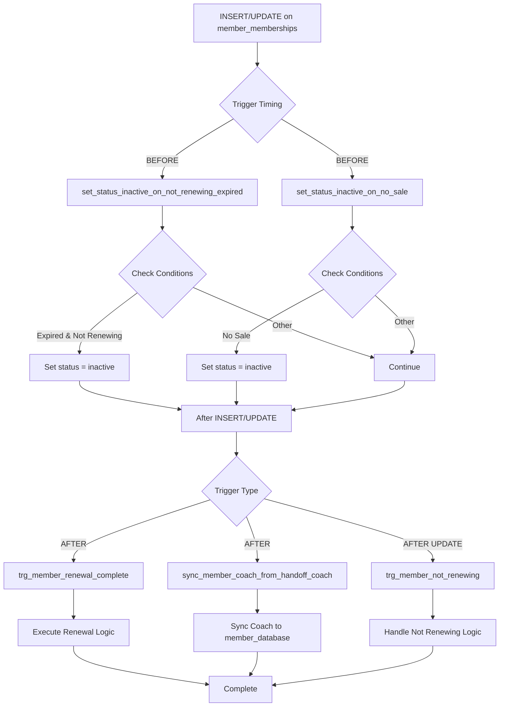
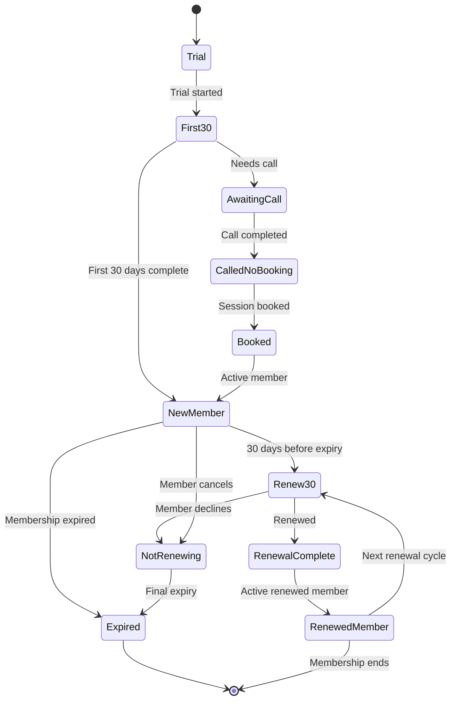

# Member Memberships Table Documentation

## Overview

The `member_memberships` table is a core table in the database that tracks membership periods, stages, and staff assignments for each member. It serves as a central record for all membership-related information, linking members to their membership types, coaches, and various metadata.

**Table Comment:** Tracks membership periods, stages, and staff assignments for each member.

**Row Count:** 1,438 records

## Table Structure

### Primary Key
- `id` (uuid) - Unique identifier for this membership record

### Core Membership Fields
- `member_id` (uuid) - Foreign key to `member_database.id` identifying the member
- `membership_type_id` (uuid) - Foreign key to `membership_types.id` defining which type of membership (3, 6, 12 months, etc.)
- `start_date` (date) - Start date of the membership period
- `end_date` (date) - End date of the membership period
- `status` (text) - Current membership status (e.g., pending, active, cancelled). Default: 'pending'
- `membership_stage` (text) - Pipeline stage label for the membership lifecycle (e.g., new, renewal, expired)
- `journey_stage` (journey_stage_type enum) - Member's lifecycle stage (e.g., first_30, booked, renewed_member)

### Staff Assignments
- `coach_id` (uuid) - Primary coach assigned to the member (FK to `staff_database.id`)
- `salesperson_id` (uuid) - Staff member who originally sold the membership
- `programming_coach_id` (uuid) - Coach responsible for programming/training plans
- `handoff_coach_id` (uuid) - Coach responsible for onboarding/handoff
- `revenue_team_assignee` (uuid) - Revenue team staff member assigned to oversee membership renewal/revenue
- `renewal_assignee` (uuid) - Staff member responsible for executing renewal
- `nutrition_lead` (uuid) - Nutrition coach assigned to the member

### Metadata References
- `newsale_metadata` (uuid) - FK to `member_newsale_metadata.id` for original sale metadata
- `renewal_metadata` (uuid) - FK to `member_renewal_meta.id` for renewal metadata

### Additional Fields
- `gym` (text) - Gym location for the membership (e.g., Bridge Street, Bligh Street)
- `test_duration` (text) - Optional trial/test duration field
- `member_name` (text) - Denormalized copy of the member's name (for convenience)
- `coach_name` (text) - Denormalized coach name (for convenience)
- `pipeline_lost` (pipelinelost_churnmarker enum) - Churn marker (good_churn, bad_churn)
- `membership_notes` (text) - Additional notes about the membership
- `primary_membership_id` (uuid) - Self-referencing foreign key for hierarchical membership relationships
- `created_at` (timestamptz) - Timestamp when this record was created

## Database Relationship Diagram

```mermaid
erDiagram
    member_memberships {
        uuid id PK
        uuid member_id FK
        uuid membership_type_id FK
        date start_date
        date end_date
        text status
        text membership_stage
        journey_stage_type journey_stage
        uuid coach_id FK
        uuid salesperson_id FK
        uuid programming_coach_id FK
        uuid handoff_coach_id FK
        uuid revenue_team_assignee FK
        uuid renewal_assignee FK
        uuid nutrition_lead FK
        uuid newsale_metadata FK
        uuid renewal_metadata FK
        uuid primary_membership_id FK
        text gym
        text membership_notes
        timestamptz created_at
    }
    
    member_database {
        uuid id PK
        text first_name
        text last_name
        text email
    }
    
    membership_types {
        uuid id PK
        text name
        membership_category_enum category
    }
    
    staff_database {
        uuid id PK
        text first_name
        text last_name
    }
    
    member_newsale_metadata {
        uuid id PK
        uuid member_id FK
        numeric price_paid
    }
    
    member_renewal_meta {
        uuid id PK
        uuid member_id FK
        numeric price_paid
    }
    
    member_addons {
        uuid id PK
        uuid membership_id FK
        uuid member_id FK
    }
    
    member_programs {
        uuid id PK
        uuid membership_id FK
        uuid member_id FK
    }
    
    member_biomap {
        uuid task_id PK
        uuid membership_id FK
        uuid member_id FK
    }
    
    member_not_renewing {
        uuid id PK
        uuid membership_id FK
        uuid member_id FK
    }
    
    member_holds {
        uuid id PK
        uuid membership_id FK
        uuid member_id FK
    }
    
    member_vo2credits {
        uuid id PK
        uuid membership_id FK
        uuid member_id FK
    }
    
    stripe_invoices {
        uuid id PK
        uuid membership_id FK
        uuid member_id FK
    }
    
    member_myzone {
        uuid id PK
        uuid initial_membership FK
        uuid member_id FK
    }

    member_memberships ||--|| member_database : "belongs to"
    member_memberships ||--|| membership_types : "has type"
    member_memberships ||--o| staff_database : "has coach"
    member_memberships ||--o| staff_database : "has salesperson"
    member_memberships ||--o| staff_database : "has programming_coach"
    member_memberships ||--o| staff_database : "has handoff_coach"
    member_memberships ||--o| staff_database : "has revenue_team_assignee"
    member_memberships ||--o| staff_database : "has renewal_assignee"
    member_memberships ||--o| staff_database : "has nutrition_lead"
    member_memberships ||--o| member_newsale_metadata : "references"
    member_memberships ||--o| member_renewal_meta : "references"
    member_memberships ||--o{ member_memberships : "has primary"
    member_memberships ||--o{ member_addons : "has"
    member_memberships ||--o{ member_programs : "has"
    member_memberships ||--o{ member_biomap : "has"
    member_memberships ||--o| member_not_renewing : "may have"
    member_memberships ||--o{ member_holds : "has"
    member_memberships ||--o{ member_vo2credits : "has"
    member_memberships ||--o{ stripe_invoices : "has"
    member_memberships ||--o{ member_myzone : "is initial for"
```

## Indexes

The `member_memberships` table has **13 indexes** for optimized query performance:

| Index Name | Type | Column(s) | Purpose |
|------------|------|-----------|---------|
| `member_memberships_pkey` | UNIQUE | `id` | Primary key constraint |
| `idx_member_memberships_member_id` | BTREE | `member_id` | Fast lookups by member |
| `idx_member_memberships_membership_type_id` | BTREE | `membership_type_id` | Filter by membership type |
| `idx_member_memberships_coach_id` | BTREE | `coach_id` | Find memberships by coach |
| `idx_member_memberships_salesperson_id` | BTREE | `salesperson_id` | Find memberships by salesperson |
| `idx_member_memberships_programming_coach_id` | BTREE | `programming_coach_id` | Find by programming coach |
| `idx_member_memberships_handoff_coach_id` | BTREE | `handoff_coach_id` | Find by handoff coach |
| `idx_member_memberships_revenue_team_assignee` | BTREE | `revenue_team_assignee` | Find by revenue team assignee |
| `idx_member_memberships_renewal_assignee` | BTREE | `renewal_assignee` | Find by renewal assignee |
| `idx_member_memberships_nutrition_lead` | BTREE | `nutrition_lead` | Find by nutrition coach |
| `idx_member_memberships_newsale_metadata` | BTREE | `newsale_metadata` | Join with new sale metadata |
| `idx_member_memberships_renewal_metadata` | BTREE | `renewal_metadata` | Join with renewal metadata |
| `idx_member_memberships_primary_membership_id` | BTREE | `primary_membership_id` | Hierarchical membership queries |

## Functions and Triggers

The `member_memberships` table has **5 trigger functions** that automatically execute on data changes:

### 1. `trg_member_not_renewing()`
- **Trigger:** `after_member_not_renewing`
- **Event:** UPDATE
- **Timing:** AFTER
- **Purpose:** Handles logic when a member is marked as not renewing

### 2. `trg_member_renewal_complete()`
- **Trigger:** `after_member_renewal_complete`
- **Event:** INSERT, UPDATE
- **Timing:** AFTER
- **Purpose:** Executes when a renewal is completed

### 3. `set_status_inactive_on_not_renewing_expired()`
- **Trigger:** `trigger_set_inactive_on_not_renewing_expired`
- **Event:** INSERT, UPDATE
- **Timing:** BEFORE
- **Purpose:** Automatically sets status to inactive when membership expires and member is not renewing

### 4. `set_status_inactive_on_no_sale()`
- **Trigger:** `trigger_set_status_inactive_on_no_sale`
- **Event:** INSERT, UPDATE
- **Timing:** BEFORE
- **Purpose:** Automatically sets status to inactive when marked as "no sale"

### 5. `sync_member_coach_from_handoff_coach()`
- **Trigger:** `trigger_sync_member_coach_from_handoff`
- **Event:** INSERT, UPDATE
- **Timing:** AFTER
- **Purpose:** Synchronizes the member's coach in `member_database` from the handoff coach assignment

## Trigger Flow Diagram

## Related Tables

### Direct Foreign Key Relationships

| Related Table | Relationship | Foreign Key Column | Description |
|--------------|--------------|-------------------|-------------|
| `member_database` | One-to-Many | `member_id` | The member who owns this membership |
| `membership_types` | Many-to-One | `membership_type_id` | Type of membership (3/6/12 months, etc.) |
| `staff_database` | Many-to-One | `coach_id` | Primary coach assignment |
| `staff_database` | Many-to-One | `salesperson_id` | Salesperson who sold membership |
| `staff_database` | Many-to-One | `programming_coach_id` | Programming coach |
| `staff_database` | Many-to-One | `handoff_coach_id` | Handoff coach |
| `staff_database` | Many-to-One | `revenue_team_assignee` | Revenue team assignee |
| `staff_database` | Many-to-One | `renewal_assignee` | Renewal assignee |
| `staff_database` | Many-to-One | `nutrition_lead` | Nutrition coach |
| `member_newsale_metadata` | Many-to-One | `newsale_metadata` | New sale transaction metadata |
| `member_renewal_meta` | Many-to-One | `renewal_metadata` | Renewal transaction metadata |
| `member_memberships` | Self-referential | `primary_membership_id` | Primary membership in hierarchy |

### Child Tables (Reference member_memberships)

| Child Table | Foreign Key Column | Description |
|------------|-------------------|-------------|
| `member_addons` | `membership_id` | Add-ons purchased with membership |
| `member_programs` | `membership_id` | Training programs assigned |
| `member_biomap` | `membership_id` | Biomap/medical task tracking |
| `member_not_renewing` | `membership_id` | Records for members not renewing |
| `member_holds` | `membership_id` | Membership holds/suspensions |
| `member_vo2credits` | `membership_id` | VO2 testing credits |
| `stripe_invoices` | `membership_id` | Payment invoices |
| `member_myzone` | `initial_membership` | MyZone device tracking |

## Membership Lifecycle Diagram

## Key Business Logic

1. **Membership Lifecycle:** Tracks members through various stages from trial → first_30 → new_member → renewal stages
2. **Staff Assignment Hierarchy:** Multiple staff members can be assigned different roles (coach, salesperson, programming, handoff, renewal, revenue, nutrition)
3. **Self-Referential Structure:** Supports hierarchical memberships via `primary_membership_id`
4. **Automatic Status Management:** Triggers automatically manage status based on renewal state and expiration dates
5. **Coach Synchronization:** Handoff coach changes automatically sync to member database

## Common Use Cases

- Query active memberships for a specific coach
- Find all memberships expiring within a date range
- Track membership renewals and sales performance
- Identify members not renewing for revenue team follow-up
- Manage membership holds and credits
- Link membership to payment invoices and add-ons

## Notes

- RLS (Row Level Security) is **disabled** on this table
- The table contains denormalized fields (`member_name`, `coach_name`) for convenience
- Multiple staff assignments allow for complex organizational structures
- Self-referential `primary_membership_id` enables membership hierarchies (e.g., primary vs. secondary memberships)
